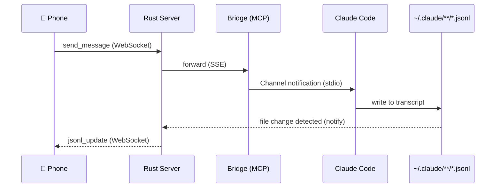
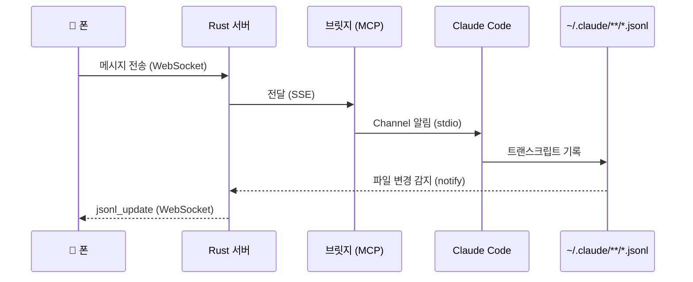

<p align="center">
  
  
</p>

<p align="center">
  <strong>Remote web UI for Claude Code</strong><br/>
  Control Claude Code sessions from your phone
</p>

<p align="center">
  <a href="#quick-start">Quick Start</a> ·
  <a href="#architecture">Architecture</a> ·
  <a href="#features">Features</a> ·
  <a href="#한국어">한국어</a>
</p>

---

## Features

- **Real-time chat** — Watch Claude Code work in real-time from your phone
- **Multi-session** — Manage multiple Claude Code sessions across different projects
- **Web terminal** — Access tmux terminal sessions directly from the browser
- **Session status** — Hook-based tracking (idle / in-progress / completed / error)
- **File upload** — Send images and files to Claude Code via the web UI
- **Canvas panel** — Side panel with dev server preview and extensible tabs
- **PWA** — Install as a native app on iOS/Android (Home Screen)
- **Notifications** — Browser notifications when tasks complete
- **Dark mode** — Follows system preference
- **Permission control** — Approve or deny Claude Code tool calls from your phone

## How it works

Spire uses Claude Code's **[Channel](https://docs.anthropic.com/en/docs/claude-code/mcp#channel-servers)** feature — a development MCP server capability that lets external tools inject messages into an active Claude Code session. A lightweight Bridge process runs alongside each Claude Code instance, connecting via stdio MCP. The Rust server watches JSONL transcript files for real-time updates instead of proxying responses through the Bridge.

## FAQ

<details>
<summary><strong>How is this different from using Claude.ai web?</strong></summary>

Claude.ai is a separate product. Spire connects to your **local Claude Code CLI sessions** — same context, same tools, same file access. You're not starting a new conversation; you're joining one that's already running on your Mac.
</details>

<details>
<summary><strong>How is this different from Claude Remote Control?</strong></summary>

[Remote Control](https://code.claude.com/docs/remote-control) connects claude.ai/code or the Claude mobile app to a local Claude Code session via Anthropic's cloud relay. Spire takes a different approach — everything stays on your local network.

|  | **Spire** | **Remote Control** |
|--|-----------|-------------------|
| **Architecture** | Self-hosted Rust server + MCP Bridge on your LAN | Anthropic cloud relays messages between devices |
| **UI** | Custom phone-first PWA | claude.ai/code or Claude mobile app |
| **Multi-session** | All running sessions visible in sidebar | One session per process (or server mode with `--spawn`) |
| **Real-time view** | JSONL file watcher — zero-latency spectating | Streamed through Anthropic API |
| **Data path** | Never leaves your network | Routed through Anthropic API (TLS) |
| **Auth** | Self-managed (local account) | Requires claude.ai OAuth (Pro/Max/Team/Enterprise) |
| **File upload** | Upload images/files from phone to session | Via claude.ai/code UI |
| **Setup** | MCP Bridge registration + Rust server | `claude remote-control` or `--rc` flag |
| **Requires internet** | No (works on LAN / Tailscale) | Yes (Anthropic API must be reachable) |
| **Terminal** | Must stay open | Must stay open |

Use Remote Control when you want zero setup and are fine with Anthropic routing. Use Spire when you want full local control, multi-session overview, or LAN-only operation.
</details>

<details>
<summary><strong>Does it work with multiple Claude Code sessions?</strong></summary>

Yes. Each Claude Code session registers its own Bridge. Spire groups them by workspace in the sidebar and tracks each session's status independently (idle / in-progress / completed).
</details>

<details>
<summary><strong>Is my data sent to any external server?</strong></summary>

No. Everything runs on your local network. The Rust server, Bridge, and Claude Code all run on your Mac. The phone connects directly to your Mac's IP. No data leaves your network.
</details>

<details>
<summary><strong>Does it work over Tailscale / VPN?</strong></summary>

Yes. As long as your phone can reach your Mac's IP, it works. Tailscale is the recommended setup for access outside your home network.
</details>

## Using on iOS

iOS requires HTTPS for PWA features (Service Worker, Notifications, Add to Home Screen). The easiest way is Tailscale:

```bash
# One command — auto TLS cert + reverse proxy
tailscale serve https / http://localhost:3000
```

Then open `https://your-mac.tailnet-name.ts.net` on your iPhone. Everything just works.

> **Why not plain HTTP?** Safari on iOS blocks Service Workers and `new Notification()` on non-secure origins. HTTPS is mandatory for PWA.

## Installation

### Option 1: curl

```bash
curl -fsSL https://raw.githubusercontent.com/Lucas20000903/spire-remote-code/main/install.sh | sh
```

### Option 2: Build from source

## Quick Start

### Option A: Using Spire CLI

```bash
# 1. Interactive setup (registers MCP Bridge + configures preferences)
spire setup

# 2. Start the server
spire

# 3. Launch Claude Code with Spire channel
spire cc
```

Open `http://<mac-ip>:3000` on your phone, create an account, and install as PWA.

### Option B: Manual Setup

<details>
<summary>Build from source and configure manually</summary>

#### 1. Build

```bash
# Rust server
cargo build --release

# Frontend
cd web && pnpm install && pnpm build && cd ..

# Bridge
cd bridge && npm install && cd ..
```

#### 2. Run

```bash
STATIC_DIR=web/dist ./target/release/spire
```

#### 3. Register Bridge MCP Server

```bash
claude mcp add -s user spire npx tsx /path/to/spire/bridge/bridge.ts
```

#### 4. Claude Code Launch Config

The `--dangerously-load-development-channels` flag is required to activate the Bridge. Wrap it in a shell function:

```bash
# ~/.zshrc or ~/.bashrc
claude() {
  if [ -z "$TMUX" ]; then
    local session_name="claude_$(uuidgen | cut -c1-8)"
    tmux new-session -s "$session_name" "command claude --dangerously-load-development-channels server:spire $*"
  else
    command claude --dangerously-load-development-channels server:spire "$@"
  fi
}
```

Or a simple alias:

```bash
alias claude='claude --dangerously-load-development-channels server:spire'
```

#### 5. Connect from Phone

1. Open `http://<mac-ip>:3000`
2. Create account on first visit
3. Log in and see active sessions
4. Install as PWA (browser menu → "Add to Home Screen")
</details>

## Data Flow



## Environment Variables

| Variable | Default | Description |
|----------|---------|-------------|
| `PORT` | `3000` | Server port |
| `STATIC_DIR` | (none) | Frontend build directory |
| `BRIDGE_PORT_RANGE` | `8800-8899` | Bridge port range |

## CLI

```bash
spire                # Start server (default port from preferences.toml)
spire -p 8080        # Start server on custom port
spire cc             # Launch Claude Code with Spire channel (tmux)
spire setup          # Interactive setup (MCP registration + preferences)
spire rebuild        # Rebuild frontend from source and deploy
spire reset-auth     # Reset auth (forgot password)
```

## Project Structure

```
spire/
├── src/                     # Rust backend
│   ├── main.rs              # Server entry, router, JSONL watcher
│   ├── state.rs             # AppState (shared state)
│   ├── config.rs            # AppConfig (preferences.toml, env, CLI)
│   ├── db.rs                # SQLite database
│   ├── cli.rs               # CLI subcommands (setup, cc, rebuild)
│   ├── auth/                # JWT authentication
│   ├── bridge/              # Bridge registry, SSE
│   ├── ws/                  # WebSocket hub
│   ├── jsonl/               # JSONL parser + file watcher
│   ├── session/             # Tmux session manager + project scanner
│   ├── terminal.rs          # PTY terminal (tmux attach)
│   ├── upload.rs            # File upload endpoint
│   └── push/                # Web Push notifications
├── bridge/
│   └── bridge.ts            # MCP channel server
├── plugin/                  # Claude Code plugin (hooks + MCP config)
│   ├── .claude-plugin/      # Plugin metadata
│   ├── .mcp.json            # Bridge MCP server registration
│   └── hooks/               # Session lifecycle hooks
├── web/
│   └── src/
│       ├── components/
│       │   ├── chat/        # Chat view, messages, input, canvas panel
│       │   ├── layout/      # App layout, sidebar
│       │   ├── terminal/    # Web terminal view
│       │   ├── session/     # Session status components
│       │   ├── webview/     # Dev server preview
│       │   ├── settings/    # Settings dialog
│       │   └── auth/        # Login/setup forms
│       ├── hooks/           # useWebSocket, useSessions, useSettings
│       └── lib/             # Types, API, notifications
├── tests/                   # Rust integration tests
└── Cargo.toml
```

## Testing

```bash
cargo test
```

## License

MIT

---

<a id="한국어"></a>

## 한국어

<p align="center">
  
  
</p>

<p align="center">
  <strong>Claude Code 원격 웹 UI</strong><br/>
  폰에서 Claude Code 세션을 원격 조작하는 웹앱
</p>

### 주요 기능

- **실시간 채팅** — Claude Code의 작업을 실시간으로 폰에서 확인
- **멀티 세션** — 여러 프로젝트의 Claude Code 세션을 동시에 관리
- **웹 터미널** — 브라우저에서 tmux 터미널 세션에 직접 접근
- **세션 상태** — Hook 기반 추적 (대기 / 진행 중 / 완료 / 에러)
- **파일 업로드** — 이미지와 파일을 웹 UI에서 Claude Code로 전송
- **캔버스 패널** — 개발 서버 미리보기 + 확장 가능한 사이드 패널
- **PWA** — iOS/Android에서 네이티브 앱처럼 설치 (홈 화면에 추가)
- **알림** — 작업 완료 시 브라우저 알림
- **다크 모드** — 시스템 설정 자동 감지
- **Permission 제어** — 폰에서 Claude Code 도구 호출 승인/거부

### 작동 원리

Spire는 Claude Code의 **[Channel](https://docs.anthropic.com/en/docs/claude-code/mcp#channel-servers)** 기능을 활용합니다. Channel은 외부 도구가 활성 Claude Code 세션에 메시지를 주입할 수 있는 개발용 MCP 서버 기능입니다. 각 Claude Code 인스턴스 옆에서 경량 Bridge 프로세스가 stdio MCP로 연결되고, Rust 서버는 JSONL 트랜스크립트 파일을 직접 감시하여 실시간 업데이트를 제공합니다.

### 자주 묻는 질문

<details>
<summary><strong>Claude.ai 웹과 뭐가 다른가요?</strong></summary>

Claude.ai는 별도의 제품입니다. Spire는 **로컬에서 실행 중인 Claude Code CLI 세션**에 연결됩니다 — 같은 컨텍스트, 같은 도구, 같은 파일 접근. 새 대화를 시작하는 게 아니라, Mac에서 이미 실행 중인 대화에 참여하는 것입니다.
</details>

<details>
<summary><strong>Claude Remote Control과 어떻게 다른가요?</strong></summary>

[Remote Control](https://code.claude.com/docs/ko/remote-control)은 claude.ai/code 또는 Claude 모바일 앱을 Anthropic 클라우드 릴레이를 통해 로컬 Claude Code 세션에 연결합니다. Spire는 다른 접근 방식을 취합니다 — 모든 것이 로컬 네트워크 안에서 동작합니다.

|  | **Spire** | **Remote Control** |
|--|-----------|-------------------|
| **아키텍처** | 셀프 호스팅 Rust 서버 + MCP Bridge (LAN) | Anthropic 클라우드가 기기 간 메시지 중계 |
| **UI** | 모바일 우선 커스텀 PWA | claude.ai/code 또는 Claude 모바일 앱 |
| **멀티 세션** | 사이드바에서 모든 실행 중인 세션 확인 | 프로세스당 1세션 (서버 모드 `--spawn`으로 확장 가능) |
| **실시간 뷰** | JSONL 파일 감시 — 제로 레이턴시 관전 | Anthropic API를 통해 스트리밍 |
| **데이터 경로** | 네트워크 밖으로 나가지 않음 | Anthropic API 경유 (TLS) |
| **인증** | 자체 관리 (로컬 계정) | claude.ai OAuth 필수 (Pro/Max/Team/Enterprise) |
| **파일 업로드** | 폰에서 이미지/파일을 세션에 업로드 | claude.ai/code UI 통해 가능 |
| **설정** | MCP Bridge 등록 + Rust 서버 | `claude remote-control` 또는 `--rc` 플래그 |
| **인터넷 필요** | 불필요 (LAN / Tailscale로 동작) | 필요 (Anthropic API 접근 필수) |
| **터미널** | 열어두어야 함 | 열어두어야 함 |

설정 없이 바로 쓰고 싶고 Anthropic 중계가 괜찮다면 Remote Control. 완전한 로컬 제어, 멀티 세션 오버뷰, LAN 전용 운영이 필요하면 Spire.
</details>

<details>
<summary><strong>여러 Claude Code 세션에서 동작하나요?</strong></summary>

네. 각 Claude Code 세션이 자체 Bridge를 등록합니다. Spire는 사이드바에서 워크스페이스별로 그룹핑하고, 각 세션의 상태를 독립적으로 추적합니다 (대기 / 진행 중 / 완료).
</details>

<details>
<summary><strong>데이터가 외부 서버로 전송되나요?</strong></summary>

아니요. 모든 것이 로컬 네트워크에서 실행됩니다. Rust 서버, Bridge, Claude Code 모두 Mac에서 실행되고, 폰은 Mac의 IP에 직접 연결됩니다. 네트워크 밖으로 데이터가 나가지 않습니다.
</details>

<details>
<summary><strong>Tailscale / VPN에서 동작하나요?</strong></summary>

네. 폰이 Mac의 IP에 접근할 수 있으면 동작합니다. 집 밖에서 접속하려면 Tailscale 사용을 추천합니다.
</details>

### 설치

#### 방법 1: npm / pnpm

```bash
npm install -g spire-remote-code
# 또는
pnpm add -g spire-remote-code
```

#### 방법 2: curl

```bash
curl -fsSL https://raw.githubusercontent.com/Lucas20000903/spire-remote-code/main/install.sh | sh
```

#### 방법 3: 소스에서 빌드

### 빠른 시작

#### 방법 A: Spire CLI 사용

```bash
# 1. 대화형 설정 (MCP Bridge 등록 + 환경 설정)
spire setup

# 2. 서버 시작
spire

# 3. Spire 채널이 활성화된 Claude Code 실행
spire cc
```

폰에서 `http://<mac-ip>:3000` 접속 → 계정 생성 → PWA로 설치하면 끝.

#### 방법 B: 수동 설정

<details>
<summary>소스에서 빌드하고 직접 설정하기</summary>

##### 1. 빌드

```bash
# Rust 서버
cargo build --release

# 프론트엔드
cd web && pnpm install && pnpm build && cd ..

# Bridge
cd bridge && npm install && cd ..
```

##### 2. 실행

```bash
STATIC_DIR=web/dist ./target/release/spire
```

##### 3. Bridge MCP 서버 등록

```bash
claude mcp add -s user spire npx tsx /path/to/spire/bridge/bridge.ts
```

##### 4. Claude Code 실행 설정

등록된 Bridge를 활성화하려면 `--dangerously-load-development-channels` 플래그가 필요합니다. 셸 함수로 감싸면 편합니다:

```bash
# ~/.zshrc 또는 ~/.bashrc
claude() {
  if [ -z "$TMUX" ]; then
    local session_name="claude_$(uuidgen | cut -c1-8)"
    tmux new-session -s "$session_name" "command claude --dangerously-load-development-channels server:spire $*"
  else
    command claude --dangerously-load-development-channels server:spire "$@"
  fi
}
```

또는 단순 alias:

```bash
alias claude='claude --dangerously-load-development-channels server:spire'
```

##### 5. 폰에서 접속

1. `http://<mac-ip>:3000` 접속
2. 최초 접속 시 계정 생성
3. 로그인 후 활성 세션 목록 확인
4. PWA로 설치 (브라우저 메뉴 → "홈 화면에 추가")
</details>

### 데이터 흐름



### 환경 변수

| 변수 | 기본값 | 설명 |
|------|--------|------|
| `PORT` | `3000` | 서버 포트 |
| `STATIC_DIR` | (없음) | 프론트엔드 빌드 디렉토리 경로 |
| `BRIDGE_PORT_RANGE` | `8800-8899` | Bridge 포트 대역 |

### 테스트

```bash
cargo test
```

### 라이선스

MIT
